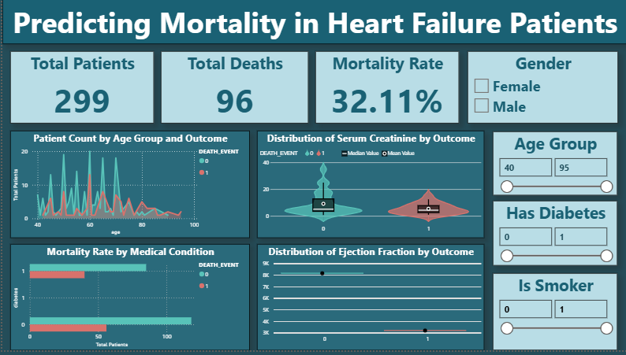

# 🫀 Predicting Mortality in Heart Failure Patients

A machine learning project that predicts the risk of death in heart failure 
patients using clinical records. Multiple classification models were built, 
compared, and evaluated to identify the best-performing approach.

---

## 📌 Project Overview

Heart failure is a critical medical condition where early prediction of 
mortality can save lives. This project applies supervised machine learning 
on real clinical data to classify whether a patient is at risk of death, 
helping support clinical decision-making.

---

## 🎯 Results Summary

| Model         | Accuracy | Notes                        |
|---------------|----------|------------------------------|
| SVM           | ~80%     | Baseline model               |
| ANN           | ~82%     | Deep learning approach       |
| Random Forest | **83%**  | ✅ Best model — selected      |
| XGBoost       | ~82%     | Gradient boosting approach   |

> Random Forest was selected as the final model due to its best recall (71%), 
> which is critical in medical diagnosis to minimize missed death predictions.

## 🤖 Agentic AI Integration
- Integrated Google Gemini AI to automatically analyze model predictions
- Generated real-time clinical insight reports using Power BI dashboards
- Agentic pipeline provides automated decision support for doctors

---

## 📊 Heart Failure Mortality Analysis | Power BI Dashboard

I developed this Power BI dashboard to explore the key drivers of mortality in heart failure patients. The goal was to create an intuitive tool that translates complex clinical records into actionable visual insights for better understanding and analysis.



### ✨ Key Highlights:

- **Mortality Risk Analysis** — Based on key demographics and pre-existing medical conditions
- **Visual Comparison** — Critical clinical indicators (Serum Creatinine, Ejection Fraction) between patient outcomes
- **Dynamic Slicers & KPI Cards** — Immediate insights and deep-dive exploration into the data
- **Interactive Visualizations** — Drill-down capabilities for granular patient analysis
- **Clinical Indicators Tracking** — Real-time monitoring of key health metrics

### 📊 Tools Used: 
**Power BI** — Advanced data visualization and business intelligence

---

## 🗂️ Dataset

- **Source:** [Heart Failure Clinical Records Dataset — UCI / Kaggle](https://www.kaggle.com/datasets/andrewmvd/heart-failure-clinical-data)
- **Records:** 299 patients
- **Features:** 12 clinical features including age, ejection fraction, 
  serum creatinine, serum sodium, platelets, and more
- **Target:** `DEATH_EVENT` (0 = Survived, 1 = Died)

---

## ⚙️ Tech Stack

- **Language:** Python
- **Libraries:** Pandas, NumPy, Scikit-learn, XGBoost, TensorFlow/Keras, 
  Imbalanced-learn (SMOTE), Matplotlib, Seaborn
- **Visualization:** Power BI
- **AI Integration:** Google Gemini API

---

## 🔬 Methodology

1. **Exploratory Data Analysis (EDA)**
   - Class distribution analysis
   - Correlation heatmap
   - Feature distribution using boxen plots and swarm plots

2. **Data Preprocessing**
   - Feature scaling using StandardScaler
   - Train-test split (75% / 25%)
   - Class imbalance handled using **SMOTE** (Synthetic Minority Oversampling)

3. **Models Trained**
   - Support Vector Machine (SVM)
   - Artificial Neural Network (ANN) — with Dropout & EarlyStopping
   - Random Forest Classifier
   - XGBoost Classifier

4. **Evaluation Metrics**
   - Accuracy, Precision, Recall, F1-Score
   - Confusion Matrix

---

## 📁 Project Structure
```
heart-failure-prediction/
├── Predicting mortality in heart failure patients.ipynb   ← Main notebook
├── Predicting-mortality-in-heart-failure-patients-PowerBI.png  ← Dashboard
├── requirements.txt
└── README.md
```

---

## 📈 How to Use the Dashboard

1. **Load the Data** — Use the CSV file or connect directly to your data source
2. **Interact with Slicers** — Filter by age group, gender, medical conditions
3. **Explore KPIs** — View mortality rates and critical patient metrics
4. **Deep-Dive Analysis** — Click on visualizations to explore patient segments
5. **Export Insights** — Generate reports for clinical decision support

---

## 🚀 Future Enhancements

- Deploy models as APIs for real-time predictions
- Integrate with Electronic Health Record (EHR) systems
- Expand dashboard with predictive analytics
- Implement automated alert systems for high-risk patients

---

## 📝 License

This project is open source and available for educational and research purposes.

---

## 👨‍💻 Author

**Akshay KV** — Machine Learning & Data Visualization Enthusiast

Feel free to reach out for collaboration or questions!
